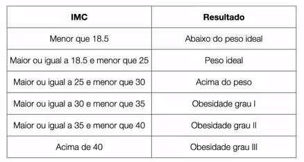

# Estrutura Condicional `if`

Nesse exemplo, vamos trabalhar com um exemplo prático. Usaremos o cálculo do IMC.

Veja o exemplo da tabela abaixo:

A partir da tabela, vamos conhecer mais sobre a estrutura condicional `if`.

Vamos seguir os passos abaixo:

1. Criar uma classe com o nome `CaclculadoraIndiceMassaCorporal`
2. Criar um método `main`
3. Importar a classe `Scanner`
4. Capturar a entrada do peso do usuário
5. Capturar a entrada de altura do usuário
6. Calcular o IMC do usuário
7. Usar a estrutura `if` para verificar a classificação do usuário de acordo com a tabela

