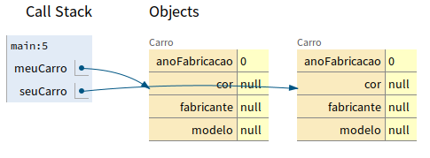
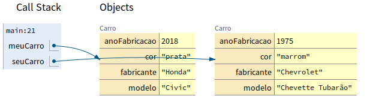

# Criando uma Classe com Atributos

Imagine que fomos contratados por uma empresa para gerenciar carros.

Primeiro, vamos criar uma classe `Carro`.

```java
public class Carro {
  
}
```

Mas um carro possuí característcas/atributos. Vamos inserir algumas.

Pode surgir a pergunta: "Quais característcas/atributos devo inserir"?

A resposta é: depende do seu problema a ser resolvido.

## Criando a classe com seus atributos

```java
public class Carro {
  String fabricante;
  String modelo;
  String cor;
  int anoFabricacao;
}
```

Criamos uma classe `Carro` com alguns atributos. Agora vamos instanciar, ou seja, criar um novo objeto à partir da classe `Carro`.

Para isso, vamos criar uma nova classse `Main`.

## Instanciando objetos

```java
public class Main {
  public static void main(String[] args) {
    // aqui estamos criando um novo objeto do tipo Carro
    Carro meuCarro = new Carro();
    // criamos outro objeto do tipo Carro. Podemos criar quantos quisermos.
    Carro seuCarro = new Carro();
  }
}
```

O objeto `meuCarro` possui os atributos definidos, mas repare que, como não os definimos na criação do objeto, eles estão assim:

- `fabricante = null`
- `modelo = null`
- `cor = null`
- `anoFabricacao = 0`

Veja a imagem abaixo:



Repare que são objetos com referências diferentes na memória. Apesar de possuirem a mesma "forma", eles são diferentes.

## Acessando atributos com objetos

É possível acessar os atributos e métodos de um objeto;

```java
public class Main {
  public static void main(String[] args) {
    Carro meuCarro = new Carro();

    // atribuindo valores aos atributos
    meuCarro.modelo = "Civic";
    meuCarro.fabricante = "Honda";
    meuCarro.anoFabricacao = 2018;
    meuCarro.cor = "prata";

    System.out.printf("Modelo: %s%n", meuCarro.modelo);
    System.out.printf("Ano Fabricação: %s%n", meuCarro.anoFabricacao);

    Carro seuCarro = new Carro();
  }
}
```

Veja que agora, o nosso objeto possui atributos preenchidos com valores:

- `fabricante = "Honda"`
- `modelo = "Civic"`
- `cor = "Prata"`
- `anoFabricacao = 2018`

Veja a imagem abaixo:

