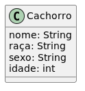

# Linguagem UML

A **Unified Modeling Language** ou **Linguagem de Modelação Unificada** é uma linguagem utilizada para modelar e documentar fases do desenvolvimento de um sistema orientado a objetos.

O diagrama da UML mais usado é o Diagrama de Classes.

Agora, imagine que você foi incubido de desenvolver um sistema de controle de animais.

A clínica tem o foco em cachorros, por isso, eles precisam das seguintes informações: nome, raça, sexo e idade do animal.

1. Crie um simples diagrama de classes para representar o domínio do problema;
2. Crie uma classe `Cachorro`;
3. Crie uma classe `Main`;
4. Instancie dois objetos do tipo `Cachorro`;
5. Atribua valores aos atributos dos objetos;

### Resposta

1. Diagrama



2. Classe `Cachorro`

```java
public class Cachorro {
  String nome;
  String raca;
  String sexo;
  int idade;
}
```

3. Classe `Main`

```java
public class Main {
  public static void main(String[] args) {}
}
```

4. Instancie dois objetos do tipo `Cachorro`;

```java
public class Main {
  public static void main(String[] args) {
    Cachorro milo = new Cachorro();
    Cachorro laika = new Cachorro();
  }
}
```

5. Atribua valores aos atributos dos objetos;

```java
public class Main {
  public static void main(String[] args) {
    Cachorro milo = new Cachorro();
    milo.nome = "Milo";
    milo.raca = "Não definida";
    milo.sexo = "Macho";
    milo.idade = 11;

    Cachorro laika = new Cachorro();
    laika.nome = "Laika";
    laika.raca = "Pintcher";
    laika.sexo = "Fêmea";
    laika.idade = 7;
  }
}
```