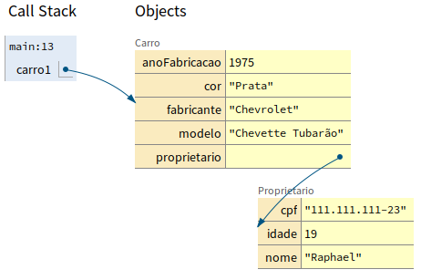

# Composição de Objetos

A composição de objetos, ajuda a resolver problemas como o seguinte:

- Imagine que você tem uma classe `Carro` com a seguinte estrutura:

```java
public class Carro {
  String fabricante;
  String modelo;
  String cor;
  int anoFabricacao;
}
```

- Agora, imagine que precisamos definir um dono para esse carro. Então faríamos:

```java
public class Carro {
  String fabricante;
  String modelo;
  String cor;
  int anoFabricacao;

  // Atributos da pessoa proprietária do carro
  String nome;
  String cpf;
  int idade;
}
```

- Só que isso não é legal, usual e prático. Na classe `Carro` eu preciso ter apenas atributos e métodos de `Carro`.
- Esse problema pode ser resolvido com a **Composição de Objetos**.
- Para isso, vamos criar uma classe `Proprietario`.

```java
public class Proprietario {
  String nome;
  String cpf;
  int idade;
}
```
- Agora, vamos inserir um novo atributo do tipo `Proprietário` na classe `Carro`.

```java
public class Carro {
  String fabricante;
  String modelo;
  String cor;
  int anoFabricacao;
  // Atributo do tipo Proprietario (criado por nós)
  Proprietario proprietario;
}
```
- Podemos ler: "_Um Carro tem um proprietário_";

No final, teremos algo assim:

```java
public class Main {
  public static void main(String[] args) {
    Carro carro1 = new Carro();
    carro1.fabricante = "Chevrolet";
    carro1.modelo = "Chevette Tubarão";
    carro1.cor = "Prata";
    carro1.anoFabricacao = 1975;

    carro1.proprietario = new Proprietario();
    carro1.proprietario.nome = "Raphael";
    carro1.proprietario.cpf = "111.111.111-23";
    carro1.proprietario.idade = 19;
  }
}
```

