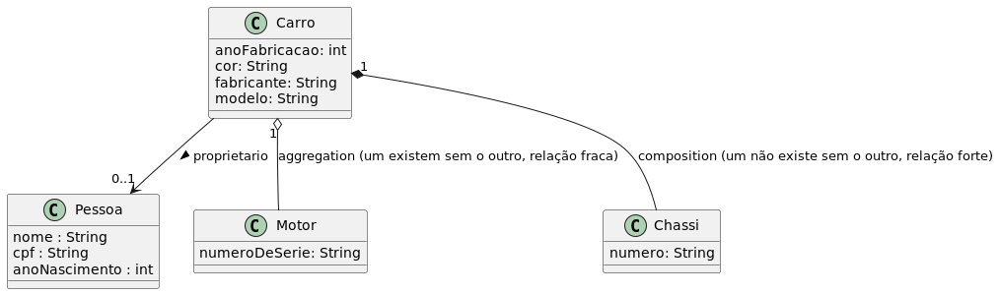

# Diagrama de Classes: Associação, Agregação e Composição

Abaixo temos uma imagem que explica os três tipos de relações entre classes.

- Uma objeto `Carro` possui uma relação com o objeto `Pessoa`, de maneira uma pessoa pode ter 0 ou 1 carro. E tem um atributo `proprietario` que liga os dois.
- Um carro pode ter um motor, mas ambos podem coexistir, um sem o outro. Essa é uma relação de agregação e é fraca.
- Já um carro só pode ter um chassi, e um não existe sem o outro. Portanto é uma relação forte.