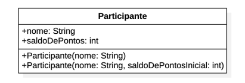

# Desafio - Construtores

Você trabalha em uma empresa de programa de milhas que está começando a desenvolver
seu sistema agora, para concorrer com outras empresas do segmento.

A primeira classe para começar codificar já foi modelada em um diagrama de classes por
um colega sênior da empresa, que pediu para você implementar em código Java.

Transforme esse diagrama em código para criar os construtores, validar os argumentos, etc.

Depois, crie uma classe `Main` para testar a instanciação de objetos do
tipo `Participante`.