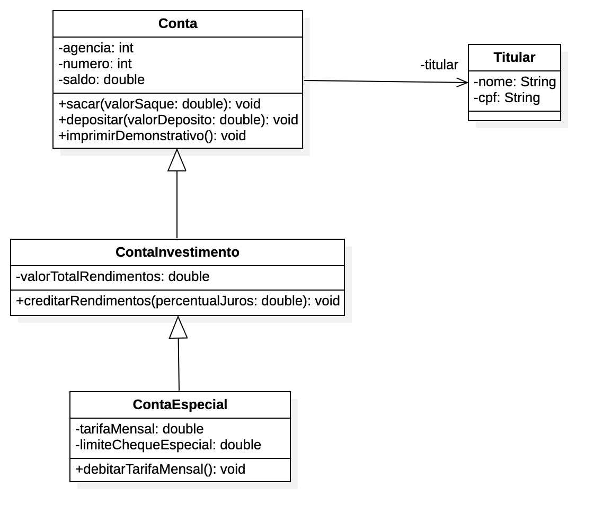

# 11. 💰 Herança

Neste capítulo, vamos aprender sobre herança, que é um dos pilares da orientação a objetos. Vamos ver como criar classes
filhas a partir de classes pai, como sobrescrever métodos e como utilizar o conceito de polimorfismo.

Para isso, vamos usar um pequeno projeto de banco como exemplo.

A estrutura inicial é:

```
src/
├── br/
│   └── com/
│       └── elraphael/
│           └── banco/
│               ├── Conta.java
│               └── Titular.java
└── Main.java          
```

## Classes Etiquetadas (tagged class)

Vamos supor que temos vários tipos de contas, e que estas serão rotuladas/etiquetadas por um atributo chamado `tipo`,
que irá definir qual o tipo de conta.

Poderíamos usar `enums`, mas como ainda não temos conhecimento. Vamos usar essas variáveis.

Veja o código da classe `Conta`. Você verá que ao criarmos uma classe dessa maneira, fazemos com que:

- O código seja de difícil manutenabilidade
- Várias condicionais dependendo do tipo de conta
- Maior uso de memória
- Imagine se tivéssemos outros tipos de contas bancárias
- Então, essa não é uma boa prática

## Duplicando classes e Isolando comportamentos

Agora vamos criar outras classes, tais como: `ContaEspecial` e `ContaInvestimento`. Além disso, vamos isolar suas
responsabilidades.

Nossa estrutura ficaria assim:

```
src/
├── br/
│   └── com/
│       └── elraphael/
│           └── banco/
│               ├── Conta.java
│               ├── ContaEspecial.java ✅
│               ├── ContaInvestimento.java ✅
│               └── Titular.java
└── Main.java          
```

Mas, criando essas outras duas classes, vamos percebendo que também estamos duplicando muito código.

Existe muita coisa em comum em ambas as classes de conta.

Agora imagine novamente se tivéssemos novos tipos de conta?

Podemos resolver isso com **Herança**!

## Herança

A herança é um dos pilares da programação orientada a objetos. Você pode perceber que:

1. A classe `Conta` possui os seguintes atributos e métodos:
    1. **Atributos**
        1. titular
        2. agencia
        3. numero
        4. saldo
    2. **Métodos**
        1. sacar
        2. depositar
        3. imprimirDemonstrativo
2. A classe `ContaInvestimento` possui os seguintes atributos e métodos:
    1. **Atributos**
        1. titular
        2. agencia
        3. numero
        4. saldo
        5. valorTotalRendimentos
    2. **Métodos**
        1. sacar
        2. depositar
        3. imprimirDemonstrativo
        4. creditarRendimentos
3. A classe `ContaEspecial` possui os seguintes atributos e métodos:
    1. **Atributos**
        1. titular
        2. agencia
        3. numero
        4. saldo
        5. valorTotalRendimentos
        6. tarifaMensal
        7. limiteChequeEspecial
    2. **Métodos**
        1. sacar
        2. depositar
        3. imprimirDemonstrativo
        4. creditarRendimentos
        5. creditarTarifaMensal

Repare que em ambas as classes, temos tanto atributos quanto métodos repetidos.

Vamos usar a herança para resolver esse problema.

Para isso vamos seguir a seguinte lógica:

1. Uma `Conta` tem um `Titular` (composição)
2. Uma `ContaInvestimento` é um tipo de `Conta`, portanto pode herdar os comportamentos a atributos da última;
3. Uma `ContaEspecial` é um tipo de `ContaInvestimento`, portanto pode herdar os comportamentos a atributos da última;



Observações:

1. Uma classe só pode herdar somente comportamentos e atributos de outra classe
2. Não use herança apenas para reaproveitamento de código, isso pode gerar problemas

## Sobrescrita de métodos

A nossa classe `ContaEspecial` possui um atributo `limiteChequeEspecial` que define uma quantidade do cheque especial.
Porém, ao chamarmos o método `imprimirDemonstrativo`, o saldo aparecerá zerado, pois estamos usando o
método `imprimirDemonstrativo` da classe `Conta` (herança).

Isso é um problema, não é? E como resolvemos? Usando a sobrescrita de métodos.

Para ser uma sobrescrita:

1. O método deve ter a mesma assinatura do método da classe mãe
    1. Mesmo nome
    2. Mesmos parâmetros
    3. Mesmo retorno

Lembre-se:

1. Sobrescrita é diferente de sobrecarga
2. Na sobrecarga, o método tem o mesmo nome, porém com parâmetros diferentes

Método `imprimirDemonstrativo` da classe `Conta`:

```java
  public void imprimirDemonstrativo(){
    System.out.println();
    System.out.printf("Agência: %d%n",getAgencia());
    System.out.printf("Conta: %d%n",getNumero());
    System.out.printf("Titular: %s%n",getTitular().getNome());
    System.out.printf("Saldo: %.2f%n",getSaldo());
    }
```

Método `imprimirDemonstrativo` da classe `ContaEspecial`:

```java
  public void imprimirDemonstrativo(){
    System.out.println();
    System.out.printf("Agência: %d%n",getAgencia());
    System.out.printf("Conta: %d%n",getNumero());
    System.out.printf("Titular: %s%n",getTitular().getNome());
    System.out.printf("Saldo: %.2f%n",getSaldo());
    System.out.printf("Saldo Disponível: %.2f%n",getSaldoDisponivel()); // linha adicionada
    }
```

Espera... Ainda sim, estamos repetindo muito código.

## Anotations (`@Override`)

Esse é um recurso que permite adicionardmos metadadados em membros de classe, como atributos e métodos.

A sua sintaxe é: `@nomeDaAnotacao`

É como se fosse um carimbo, rótulo adicionado à classe, para ser tratado de maneira especial pelo compilador.

Vamos ver uma annotation chamada `@override`, sobre sobrescrita.

Vamos usar ele no método `imprimirDemonstrativo`. Ele informa de maneira explícita que vamos sobrescrever o método da
superclasse.

Método `imprimirDemonstrativo` da classe `ContaEspecial`:

```java
public class ContaEspecial {
  // ...
  @Override
  public void imprimirDemonstrativo() {
    System.out.println();
    System.out.printf("Agência: %d%n", getAgencia());
    System.out.printf("Conta: %d%n", getNumero());
    System.out.printf("Titular: %s%n", getTitular().getNome());
    System.out.printf("Saldo: %.2f%n", getSaldo());
    System.out.printf("Saldo Disponível: %.2f%n", getSaldoDisponivel()); // linha adicionada
  }
}
```

Ou melhor ainda, poderia ficar assim:

```java
public class ContaEspecial {
  // ...
  @Override
  public void imprimirDemonstrativo() {
    // aqui estamos chamando o método da super classe
    super.imprimirDemonstrativo();

    // e adicionamos uma linha que é a única diferente
    System.out.printf("Saldo Disponível: %.2f%n", getSaldoDisponivel());
  }
}
```

## A classe `Object`

- Toda classe herda outra classe, que no caso é a `Object`. Essa é a classe raiz.
- Mas geralmetne não usamos `public class Conta extends Object`, pois é algo implícito
- Ela possui alguns métodos
- É possível instanciá-la normalmente como qualquer outra classe

## Invocando construtores da superclasse

- Mesmo que não deixemos de maneira explícita os construtores de classes que herdam outras classes, eles são chamados por padrão;
- Se não formos passar nenhum atributo na hora de instanciar um novo objeto, não precisamos escrever um novo construtor
- Mas poderíamos, caso fosse necessário. Essa é a sintaxe:

```java
public class ContaEspecial {
  public ContaEspecial() {
    super();
  }

  // ...
}
```