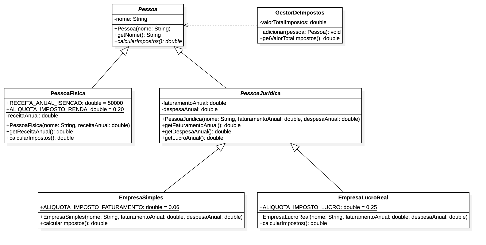

# Desafio de Classes Abstratas

## Objetivo

O objetivo deste desafio é criar um pequeno projeto de cálculo de impostos de pessoas jurídicas e físicas.

Você deverá seguir o diagrama abaixo para criar as classes necessárias.

