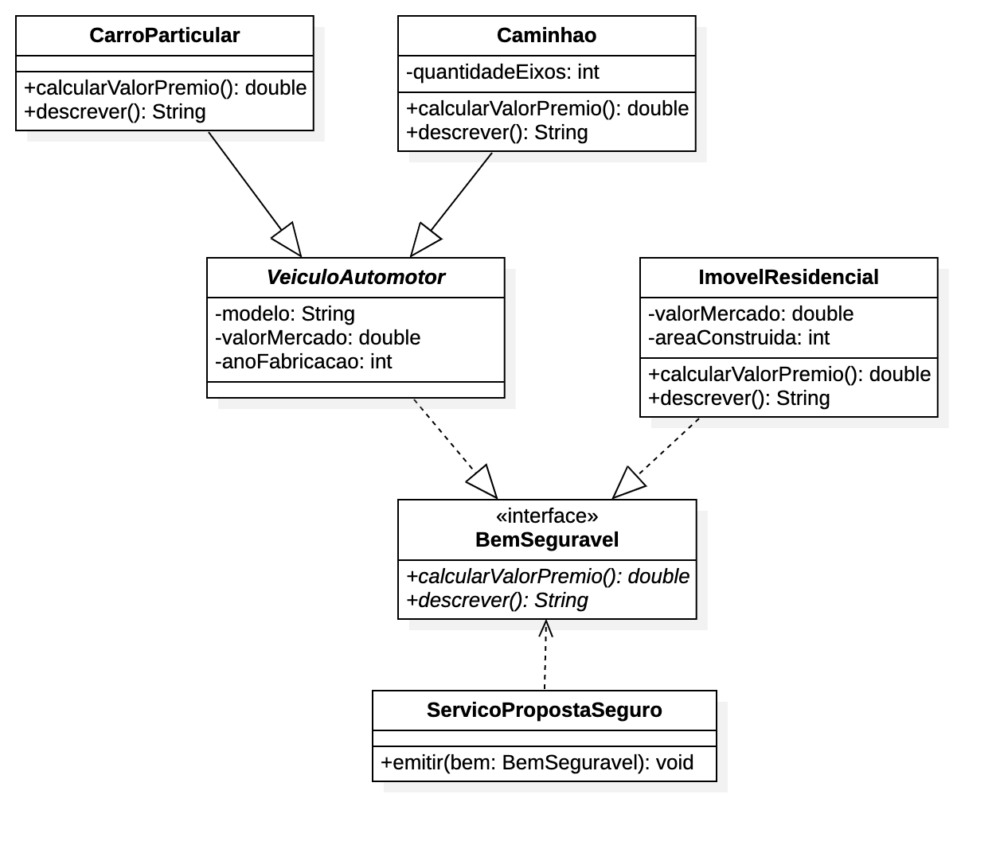

# Desafio de Interfaces

## Desafio

Você deve implementar uma solução para uma seguradora que deseja calcular o valor do seguro para bens.

Para isso, você deverá solucionar o problema usando o diagrama de classes abaixo:

