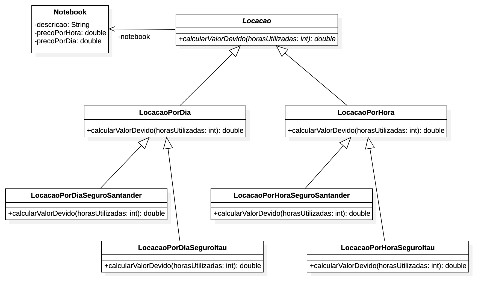
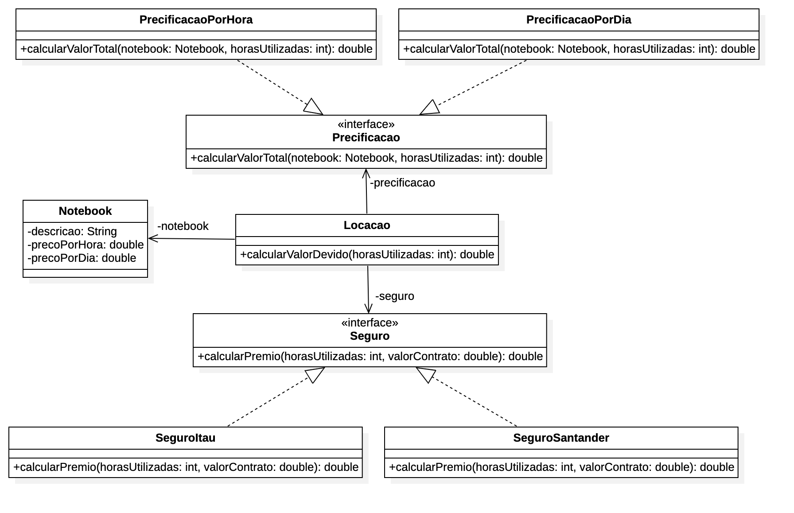

# Rigidez do código com Herança

Vamos trabalhar com um exemplo de código que utiliza herança para resolver um problema.

Será um projetinho de uma locadora de notebooks.

Vamos implementar a seguinte estrutura de classes:

Você pode perceber que a maneira como o código está estruturado, não é muito flexível.

Prefira em vez disso, utilizar composição.

A composição é uma forma de reutilização de código que permite que você tenha mais flexibilidade na hora de alterar o código.

Tudo isso usando polimorfismo e interfaces.

Usando composição, temos o seguinte diagrama refatorado:

